# 🚀 Smart Toxic Classifier

> Transformer-based system for automatic toxic comment classification in Russian using **RuBERT**.


---

# 📌 Project Overview

**Smart Toxic Classifier** — это полноценный NLP-проект по автоматической классификации русскоязычных комментариев на токсичные и нетоксичные.

Основная цель проекта — исследовать данные, обучить современную трансформерную модель RuBERT для бинарной классификации текста, оценить её качество с использованием различных метрик и предоставить возможность использовать модель через REST API.

Проект объединяет несколько направлений Data Science:

- Exploratory Data Analysis (EDA);
- Data Preprocessing;
- Tokenization;
- Fine-tuning Transformer Model;
- Model Evaluation;
- Error Analysis;
- Threshold Optimization;
- Backend Deployment.

---

# 🎯 Problem Statement

Автоматическая модерация комментариев является одной из ключевых задач современных онлайн-платформ.

Классические методы машинного обучения (например TF-IDF + Logistic Regression) способны обнаруживать токсичные слова, однако практически не учитывают контекст предложения.

Например:

> "Ты молодец"

и

> "Ты молодец... конечно."

могут иметь совершенно разный смысл.

Поэтому в данном проекте используется трансформерная архитектура **RuBERT**, позволяющая учитывать контекст предложения целиком.

---

# 🎯 Project Goals

В рамках проекта были поставлены следующие задачи:

- провести исследовательский анализ данных (EDA);
- проверить качество датасета;
- изучить распределение классов;
- исследовать длину комментариев;
- определить оптимальную максимальную длину последовательности (`max_length`);
- подготовить данные для обучения;
- выполнить токенизацию текста;
- дообучить модель RuBERT;
- оценить качество модели;
- провести анализ ошибок модели;
- подобрать оптимальный threshold классификации;
- сравнить результаты с классической моделью TF-IDF + Logistic Regression;
- сохранить обученную модель;
- реализовать REST API на FastAPI;
- создать CLI-интерфейс для инференса.

---

# 🛠️ Technologies

## Machine Learning

- Python
- PyTorch
- Hugging Face Transformers
- RuBERT (`cointegrated/rubert-tiny2`)
- Scikit-learn
- Pandas
- NumPy
- Matplotlib
- Seaborn
- Evaluate
- Hugging Face Datasets

---

## Backend

- FastAPI
- Pydantic
- Uvicorn

---

## Development

- Jupyter Notebook
- Git
- GitHub

---

# 📊 Dataset

В проекте используется размеченный датасет русскоязычных комментариев.

Размер датасета:

| Параметр | Значение |
|----------|----------:|
| Количество комментариев | **14 412** |
| Признаков | **2** |

Структура данных:

| Column | Description |
|---------|-------------|
| comment | текст комментария |
| toxic | метка класса (0 / 1) |

---

## Проверка качества данных

Перед обучением модели был выполнен первичный анализ данных.

Проверено:

- наличие пропусков;
- типы данных;
- структура датасета;
- случайные примеры комментариев.

### Результат

✅ Пропущенных значений обнаружено не было.

Все **14 412** комментариев пригодны для обучения модели.

---

# 📈 Exploratory Data Analysis (EDA)

## Распределение классов

Количество объектов каждого класса:

| Класс | Количество |
|--------|-----------:|
| Non-toxic | **9586** |
| Toxic | **4826** |

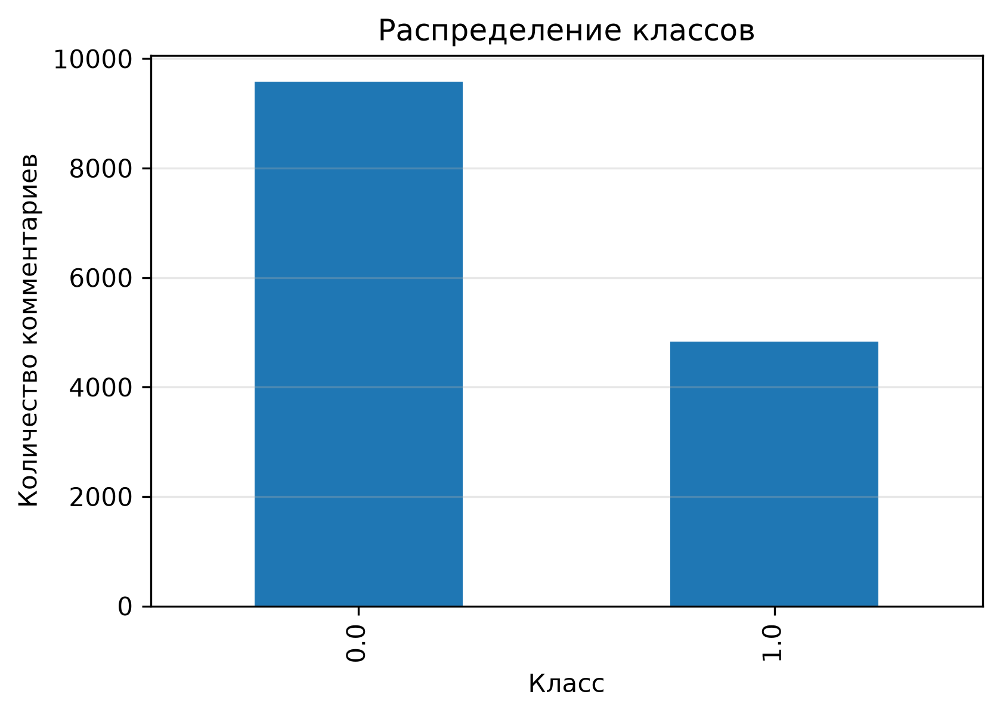

### Вывод

Датасет имеет **умеренный дисбаланс классов**.

- Non-toxic — около **66%**
- Toxic — около **34%**

Подобный дисбаланс не является критичным, однако использование только Accuracy может привести к неверной оценке качества модели.

Поэтому в проекте основное внимание уделяется следующим метрикам:

- Precision
- Recall
- F1-score

---

## Анализ длины комментариев

Перед обучением была исследована длина комментариев.

Основные статистики:

| Метрика | Значение |
|---------|----------:|
| Средняя длина | **176.5** символов |
| Медиана | **101** |
| Минимум | **21** |
| Максимум | **7404** |

---

## Средняя длина комментариев по классам

Дополнительно была исследована длина комментариев отдельно для каждого класса.

| Класс | Средняя длина |
|--------|--------------:|
| Non-toxic | **194.2** |
| Toxic | **141.4** |

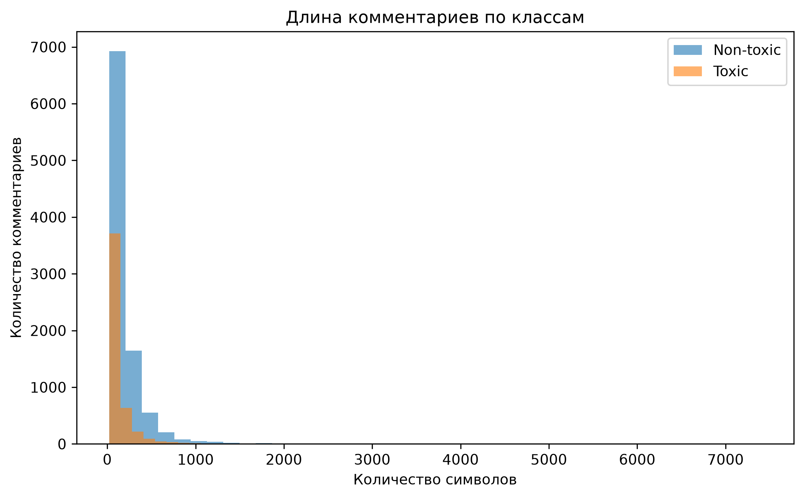

### Вывод

Нетоксичные комментарии в среднем длиннее токсичных.

При этом распределения существенно пересекаются, поэтому длина сообщения сама по себе не может использоваться как надежный признак токсичности.

Однако этот показатель позволяет лучше понять структуру датасета и помогает выбрать параметры токенизации.

---

### WordCloud нетоксичных комментариев

Облако слов позволяет визуально определить наиболее часто встречающиеся слова в нетоксичных комментариях.

По распределению можно заметить, что большинство сообщений связано с нейтральным обсуждением, вопросами и повседневным общением.

<p align="center">
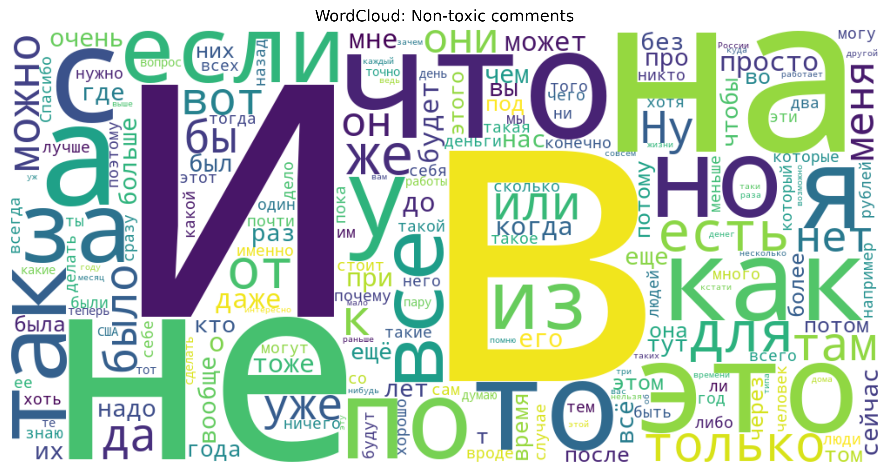
</p>


### WordCloud токсичных комментариев

Для токсичных комментариев характерно большое количество эмоционально окрашенной и оскорбительной лексики.

WordCloud позволяет быстро увидеть наиболее часто встречающиеся слова данного класса и лучше понять структуру датасета.

<p align="center">
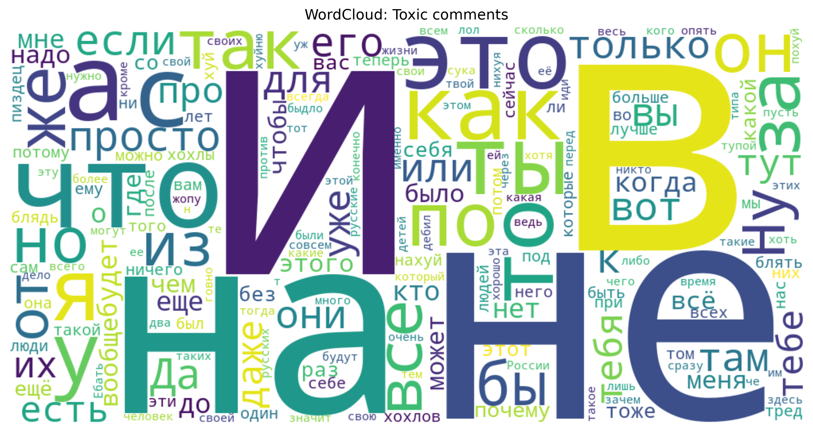
</p>

---

## Анализ количества токенов

Поскольку модель RuBERT работает с токенами, был проведен анализ распределения количества токенов.

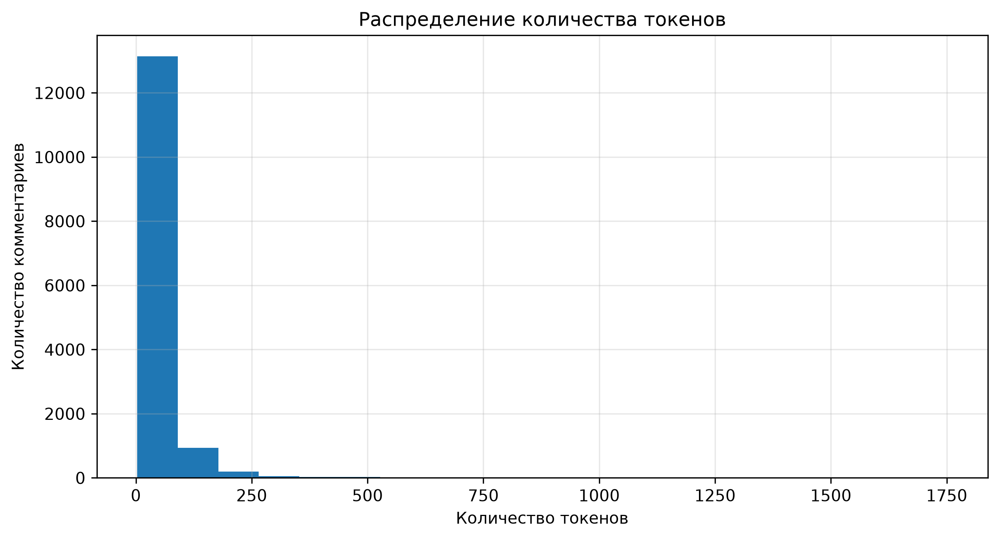

Результаты:

| Квантиль | Количество токенов |
|-----------|------------------:|
| 90% | **85** |
| 95% | **122** |
| 99% | **266** |

### Вывод

В качестве максимальной длины последовательности было выбрано

```python
max_length = 128
```

Такое значение:

- полностью покрывает более **95%** комментариев;
- сокращает время обучения;
- уменьшает потребление памяти;
- практически не приводит к потере информации.

---

# 🧹 Data Preprocessing

Для моделей семейства BERT классическая обработка текста (удаление стоп-слов, стемминг, лемматизация) не требуется.

Используется исходный текст комментариев без изменения.

В процессе подготовки данных были выполнены:

- преобразование меток в тип `int`;
- стратифицированное разделение выборки;
- токенизация текста;
- преобразование данных в формат Hugging Face Dataset.

---

## Train / Test Split

Разделение выполнено с использованием стратификации (`stratify`).

| Dataset | Размер |
|----------|-------:|
| Train | **11 529** |
| Test | **2 883** |

Соотношение классов полностью сохранилось как в обучающей, так и в тестовой выборках.

---

# 🤖 Model

В качестве основной модели используется

```
cointegrated/rubert-tiny2
```

Это компактная версия RuBERT, предобученная на большом корпусе русскоязычных текстов.

В рамках проекта модель была дообучена (Fine-tuning) для решения задачи бинарной классификации токсичных комментариев.

---

# ⚙️ Training Configuration

Основные параметры обучения:

| Parameter | Value |
|-----------|-------|
| Epochs | 4 |
| Learning Rate | 2e-5 |
| Batch Size | 2 |
| Gradient Accumulation | 4 |
| Weight Decay | 0.01 |
| Optimizer | AdamW |
| max_length | 128 |

---

## Почему Batch Size = 2?

Обучение выполнялось на MacBook с чипом Apple Silicon (MPS).

Из-за ограничения доступной памяти стандартные батчи приводили к ошибке:

```
MPS backend out of memory
```

Поэтому использовалась схема:

```
Batch Size = 2

Gradient Accumulation = 4

Effective Batch = 8
```

Такой подход позволил сохранить стабильность обучения без ухудшения качества модели.

---

# 📊 Training Results

Во время обучения после каждой эпохи рассчитывались основные метрики качества.

| Epoch | Training Loss | Validation Loss | Accuracy | Precision | Recall | F1-score |
|------:|--------------:|----------------:|---------:|----------:|-------:|---------:|
| 1 | 0.271 | 0.372 | 0.909 | 0.876 | 0.850 | 0.863 |
| 2 | 0.297 | 0.412 | 0.909 | 0.888 | 0.835 | 0.861 |
| 3 | 0.249 | 0.399 | 0.916 | 0.888 | 0.856 | 0.872 |
| 4 | **0.247** | **0.415** | **0.918** | **0.868** | **0.891** | **0.879** |

В качестве лучшей модели автоматически сохранялась модель с максимальным значением **F1-score**.


# 📊 Model Evaluation

После обучения модель была протестирована на независимой тестовой выборке, содержащей **2 883 комментария**.

Для оценки качества использовались следующие метрики:

- Accuracy
- Precision
- Recall
- F1-score

Поскольку датасет содержит умеренный дисбаланс классов, основной метрикой проекта выбран **F1-score**, так как он учитывает баланс между Precision и Recall.

---

## Итоговые результаты

| Metric | Value |
|---------|------:|
| Accuracy | **0.918** |
| Precision | **0.868** |
| Recall | **0.891** |
| F1-score | **0.879** |

### Вывод

Дообученная модель RuBERT показала высокое качество классификации по всем основным метрикам.

Особенно важным является высокий показатель **Recall (89.1%)**, что означает, что модель успешно обнаруживает большую часть токсичных комментариев.

---

# 📑 Classification Report

Отдельно были рассчитаны метрики качества для каждого класса.

| Class | Precision | Recall | F1-score |
|---------|----------:|--------:|---------:|
| Non-toxic | **0.9445** | **0.9317** | **0.9380** |
| Toxic | **0.8678** | **0.8911** | **0.8793** |

### Вывод

Модель демонстрирует стабильное качество для обоих классов.

---

# 📊 Confusion Matrix

Матрица ошибок позволяет подробно проанализировать, какие типы ошибок совершает модель.

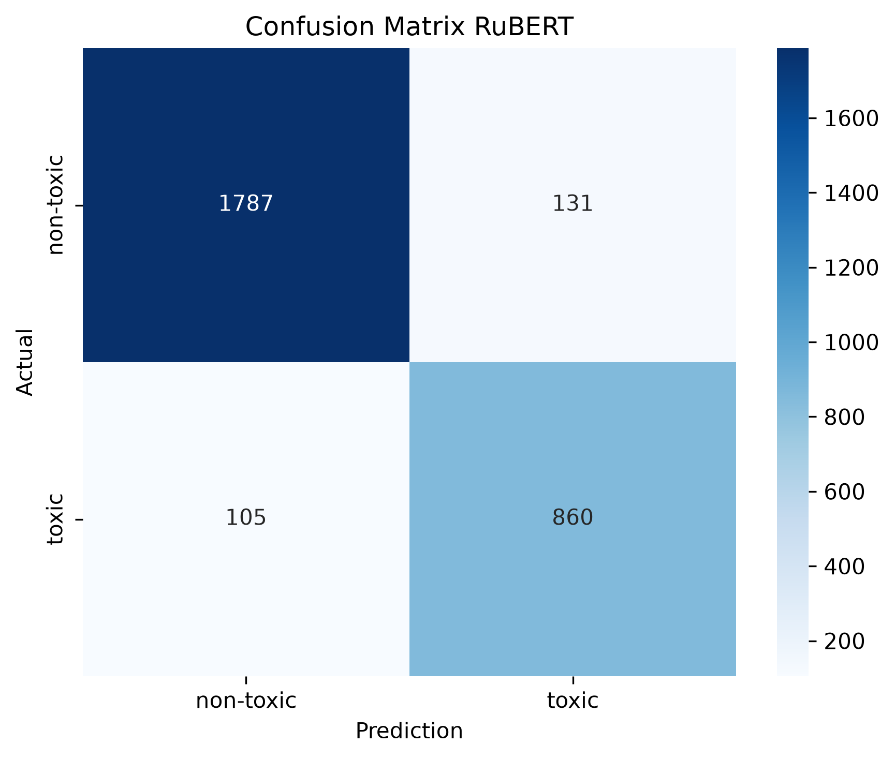

Основные типы ошибок:

- **False Positive** — нетоксичный комментарий ошибочно определён как токсичный.
- **False Negative** — токсичный комментарий ошибочно классифицирован как нетоксичный.

### Вывод

Большая часть комментариев классифицируется правильно.

Ошибки распределены достаточно равномерно, что подтверждает хорошую способность модели различать оба класса.

---

# 📈 Precision–Recall Curve

Для оценки поведения модели при различных порогах классификации была построена Precision–Recall кривая.

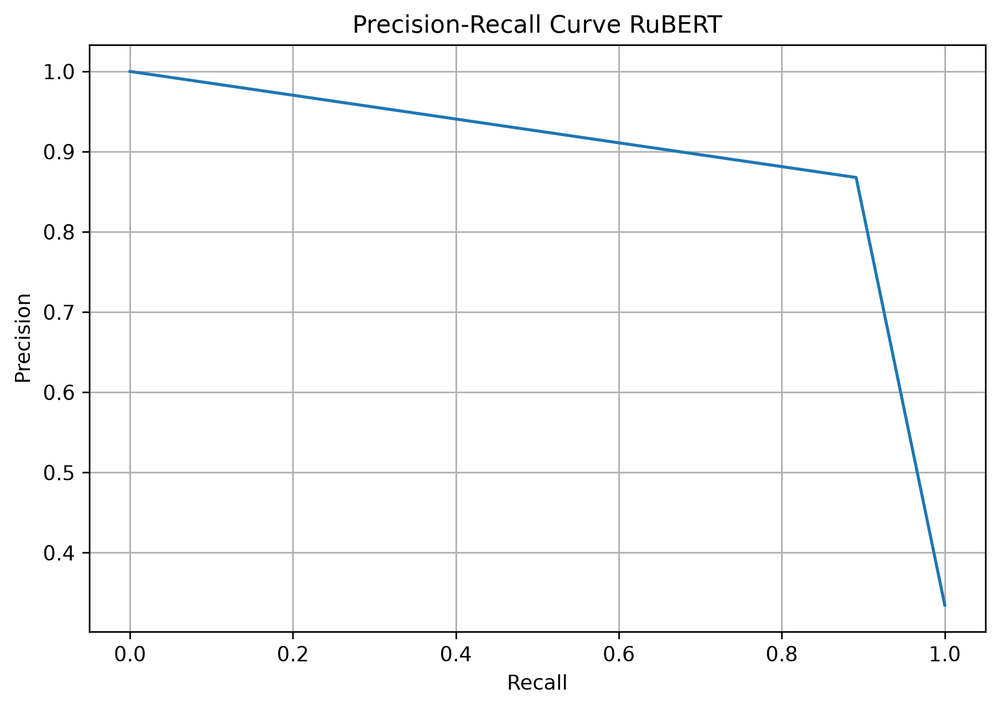

### Почему именно Precision–Recall?

Для задач обнаружения токсичного контента Precision–Recall информативнее ROC-кривой, поскольку лучше отражает качество модели при наличии дисбаланса классов.

### Вывод

Кривая показывает, что модель сохраняет высокий уровень Precision даже при увеличении Recall.

Это говорит о хорошем разделении токсичных и нетоксичных комментариев.

---

# 📈 ROC Curve

ROC-кривая демонстрирует способность модели различать токсичные и нетоксичные комментарии при различных значениях порога классификации.

В отличие от Precision-Recall Curve, ROC учитывает соотношение между:

- True Positive Rate (Recall);
- False Positive Rate.

Для количественной оценки качества используется площадь под кривой (**ROC-AUC**).

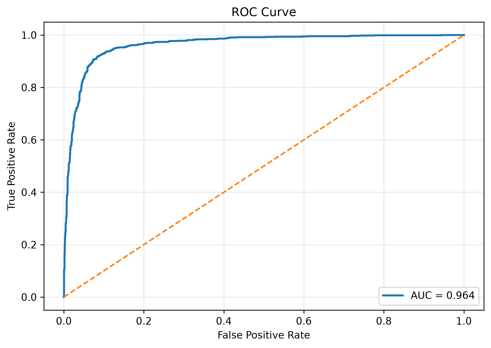

Для обученной модели RuBERT получено:

```text
ROC-AUC = 0.9637
```

Значение ROC-AUC, близкое к 1, свидетельствует о высокой способности модели разделять классы и подтверждает эффективность выбранной архитектуры.

# 🎯 Threshold Analysis

По умолчанию модель использует порог классификации

```
Threshold = 0.5
```

Однако изменение порога может существенно изменить поведение модели.

В рамках проекта была проведена оценка качества при различных значениях threshold.

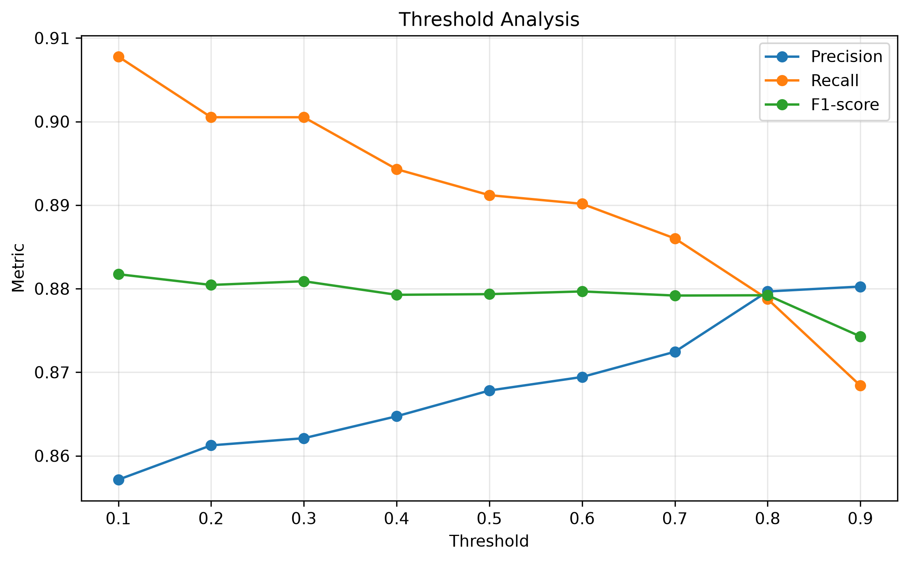

| Threshold | Precision |    Recall |            F1-score |
| --------: | --------: | --------: | ------------------: |
|       0.1 |     0.857 | **0.908** |           **0.882** |
|       0.2 |     0.861 |     0.901 |               0.880 |
|       0.3 |     0.862 |     0.901 |               0.881 |
|       0.4 |     0.865 |     0.894 |               0.879 |
|   **0.5** | **0.868** | **0.891** |           **0.879** |
|       0.6 |     0.869 |     0.890 |               0.880 |
|       0.7 |     0.872 |     0.886 |               0.879 |
|       0.8 |     0.880 |     0.879 |               0.879 |
|       0.9 | **0.880** |     0.868 |               0.874 |

### Вывод

При уменьшении порога возрастает Recall, однако увеличивается количество ложных срабатываний.

При увеличении порога повышается Precision, но часть токсичных комментариев начинает пропускаться.

Несмотря на то, что максимальное значение F1-score было достигнуто при пороге **0.1**, разница с порогом **0.5** минимальна (**0.882 против 0.879**).

Поэтому в проекте оставлен стандартный порог **0.5**, который обеспечивает более сбалансированное поведение модели и соответствует типичному сценарию использования систем автоматической модерации.

---

# 📈 Hyperparameter Tuning

Качество трансформерных моделей во многом зависит от выбранных гиперпараметров. Перед финальным обучением была подобрана конфигурация, обеспечивающая наилучший баланс между качеством классификации и временем обучения.

В ходе экспериментов анализировалось влияние следующих параметров:

- Learning Rate;
- количество эпох (Epochs);
- Effective Batch Size;
- Weight Decay.

Основной метрикой сравнения являлся **F1-score**, так как она учитывает баланс между Precision и Recall.

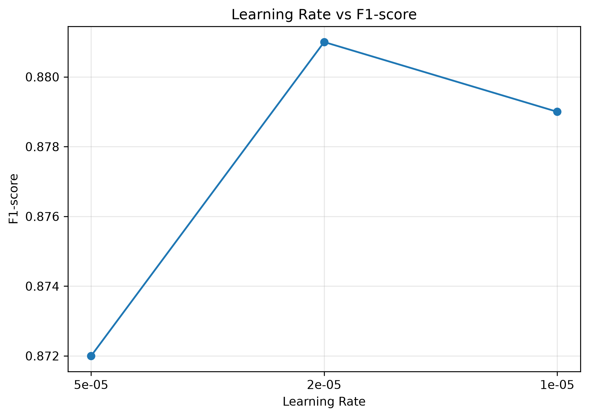

В результате проведённых экспериментов было установлено, что значение **Learning Rate = 2e-5** обеспечивает наиболее стабильное обучение модели и наилучшее качество классификации.

При использовании большего значения Learning Rate обучение становилось менее стабильным, а уменьшение скорости обучения не приводило к дополнительному улучшению качества модели.

Итоговая конфигурация позволила достичь следующих результатов на тестовой выборке:

- **Accuracy:** 0.918
- **Precision:** 0.868
- **Recall:** 0.891
- **F1-score:** **0.879**

Данная конфигурация была использована для финальной версии модели и дальнейшего развёртывания сервиса на FastAPI.

---

# 🔍 Error Analysis

Высокое качество модели не означает полного отсутствия ошибок.

Поэтому дополнительно был проведён анализ ошибочных предсказаний.

Рассматривались два типа ошибок:

- False Positive;
- False Negative.

### Наиболее частые причины ошибок

- сарказм;
- неоднозначные формулировки;
- интернет-сленг;
- эмоциональные, но нетоксичные сообщения;
- отсутствие достаточного контекста.

### Вывод

Большинство ошибок связано не с отдельными токсичными словами, а со сложной интерпретацией смысла предложения.

Подобные ошибки являются типичным ограничением современных моделей классификации текста.

---

# ⚖️ Model Comparison

Для оценки эффективности трансформерной архитектуры результаты RuBERT были сравнены с классической моделью машинного обучения.

В качестве базовой модели использовалась:

**TF-IDF + Logistic Regression**

Обе модели обучались и оценивались на одинаковом разбиении данных.

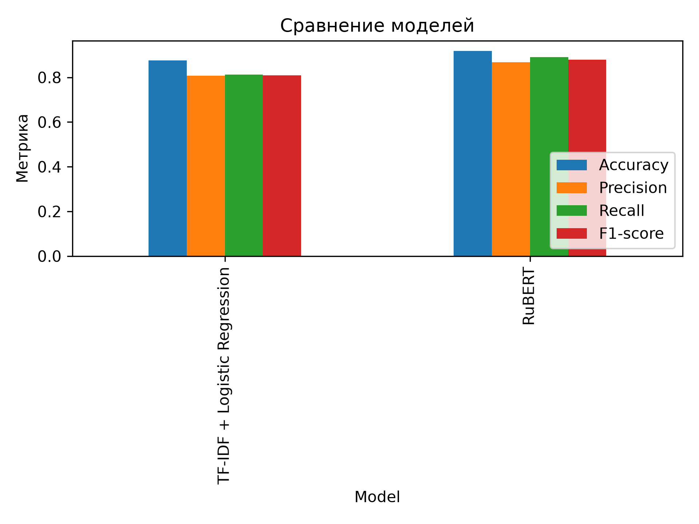

## Результаты

| Model | Accuracy | Precision | Recall | F1-score |
|------|---------:|----------:|--------:|---------:|
| TF-IDF + Logistic Regression | 0.876 | 0.807 | 0.813 | 0.810 |
| **RuBERT** | **0.918** | **0.868** | **0.891** | **0.879** |

### Улучшение качества

| Metric | Improvement |
|---------|------------:|
| Accuracy | **+4.8 п.п.** |
| Precision | **+7.6 п.п.** |
| Recall | **+9.6 п.п.** |
| F1-score | **+8.6 п.п.** |

> **Важно:** здесь приведено улучшение в **процентных пунктах (p.p.)**, а не относительный процент прироста, что корректнее для сравнения метрик классификации.

### Вывод

RuBERT превосходит классическую модель по всем основным метрикам.

Наибольший прирост наблюдается по метрике **Recall**, что означает уменьшение количества пропущенных токсичных комментариев.

Основное преимущество трансформерной архитектуры заключается в способности учитывать контекст предложения, а не отдельные слова, как это делает TF-IDF.

---

# 💬 Prediction Examples

После обучения модель была протестирована на собственных примерах.

| Comment | Prediction | Confidence |
|----------|------------|-----------:|
| привет | Non-toxic | 0.049 |
| как дела? | Non-toxic | 0.001 |
| ты молодец | Toxic | 0.997 |
| спасибо большое | Non-toxic | 0.001 |
| ты полный идиот | Toxic | 0.998 |
| ненавижу тебя | Toxic | 0.995 |
| какой ужасный человек | Toxic | 0.997 |

Можно заметить, что модель определяет выражение 'ты молодец', как **токсичное** с вероятностью 0.997


# 📂 Project Structure

```
smart-toxic-classifier/

│
├── app/
│   ├── __init__.py
│   ├── main.py              # FastAPI application
│   ├── model.py             # Model loading and inference
│   └── schemas.py           # Pydantic schemas
│
├── data/
│   └── labeled.csv          # Training dataset
│
├── images/
│   ├── class_distribution.png
│   ├── token_distribution.png
│   ├── comment_length_by_class.png
│   ├── wordcloud_non_toxic.png
│   ├── wordcloud_toxic.png
│   ├── hyperparameter_tuning.png
│   ├── confusion_matrix.png
│   ├── precision_recall_curve.png
│   ├── roc_curve.png
│   ├── threshold_analysis.png
│   └── model_comparison_chart.png
│
├── results/
│   ├── classification_report.csv
│   ├── model_comparison.csv
│   └── rubert_metrics.csv
│
├── models/
│   ├── config.json
│   ├── model.safetensors
│   ├── tokenizer.json
│   ├── tokenizer_config.json
│   └── special_tokens_map.json
│
├── notebooks/
│   └── 01_experiments.ipynb
│
├── scripts/
│   └── inference.py
│
├── README.md
├── requirements.txt
└── .gitignore
```

---

# ⚙️ Installation

## 1. Clone repository

```bash
git clone https://github.com/freedal1/smart-toxic-classifier.git

cd smart-toxic-classifier
```

---

## 2. Create virtual environment

```bash
python -m venv .venv
```

Activate:

**Windows**

```bash
.venv\Scripts\activate
```

**Linux / macOS**

```bash
source .venv/bin/activate
```

---

## 3. Install dependencies

```bash
pip install -r requirements.txt
```

---

# 🚀 Running the Project

## Jupyter Notebook

The complete machine learning pipeline is available in the notebook.

```bash
jupyter notebook notebooks/01_experiments.ipynb
```

The notebook contains:

- Exploratory Data Analysis;
- data preprocessing;
- tokenizer analysis;
- RuBERT fine-tuning;
- model evaluation;
- threshold analysis;
- error analysis;
- comparison with Logistic Regression.

---

## FastAPI Service

Start the API server:

```bash
uvicorn app.main:app --reload
```

After launching:

```
http://127.0.0.1:8000
```

Swagger UI:

```
http://127.0.0.1:8000/docs
```

---

# 🔥 REST API

## Endpoint

```
POST /predict
```

---

### Request

```json
{
    "text": "ты полный идиот"
}
```

---

### Response

```json
{
    "text": "ты полный идиот",
    "toxic": true,
    "confidence": 0.998
}
```

---

### Example

```bash
curl -X POST http://127.0.0.1:8000/predict \
-H "Content-Type: application/json" \
-d '{"text":"ты полный идиот"}'
```

---

# 💻 CLI Inference

Single prediction:

```bash
python scripts/inference.py "ты полный идиот"
```

Output:

```
📝 Text: ты полный идиот

⚠️ Toxic: YES

📊 Confidence: 0.998
```

---

Interactive mode:

```bash
python scripts/inference.py
```

---

Using the model inside another Python project:

```python
from app.model import predict

result = predict("Спасибо большое!")

print(result)
```

---

# 📈 Future Improvements

В рамках проекта реализован полный цикл разработки модели классификации текста — от исследования данных до развёртывания модели через REST API.

### Completed

- ✅ Exploratory Data Analysis (EDA)
- ✅ Missing value analysis
- ✅ Class distribution analysis
- ✅ Comment length analysis
- ✅ Token length analysis
- ✅ WordCloud
- ✅ Analysis of the most frequent tokens
- ✅ Train/Test split with stratification
- ✅ RuBERT fine-tuning
- ✅ Dynamic padding with DataCollator
- ✅ Evaluation using Accuracy, Precision, Recall and F1-score
- ✅ Classification Report
- ✅ Confusion Matrix
- ✅ Precision–Recall Curve
- ✅ ROC Curve, ROC-AUC
- ✅ Threshold Analysis
- ✅ Learning Rate, Batch Size, Epochs
- ✅ Error Analysis
- ✅ Comparison with TF-IDF + Logistic Regression
- ✅ Saving trained model
- ✅ FastAPI inference service
- ✅ CLI inference

---

### Planned

Следующие этапы направлены именно на развитие исследовательской части проекта и улучшение качества модели.

- ⏳ SHAP-анализ интерпретируемости модели

---

# ⚠️ Limitations

Несмотря на высокое качество классификации, модель имеет ряд ограничений.

- обучалась только на русскоязычных комментариях;
- не различает типы токсичности (оскорбление, угрозы, дискриминация и др.);
- может ошибаться при обработке сарказма и иронии;
- чувствительна к новым словам, интернет-сленгу и опечаткам;
- качество может снижаться для очень длинных сообщений;
- результаты напрямую зависят от качества обучающего датасета.

---

# 📌 Conclusion

В ходе проекта была разработана полноценная система автоматической классификации токсичных комментариев на русском языке.

Был проведён полный цикл решения задачи машинного обучения:

- исследование данных;
- анализ распределения классов и длины текстов;
- токенизация комментариев;
- обучение трансформерной модели RuBERT;
- оценка качества по нескольким метрикам;
- анализ ошибок модели;
- исследование влияния порога классификации;
- сравнение с классическим подходом TF-IDF + Logistic Regression;
- развёртывание модели в виде REST API.

Полученные результаты показывают, что использование современных трансформерных архитектур позволяет существенно повысить качество классификации по сравнению с традиционными методами обработки текста.

Итоговая модель достигла:

- **Accuracy — 91.81%**
- **Precision — 86.78%**
- **Recall — 89.11%**
- **F1-score — 87.93%**

Проект демонстрирует практическое применение методов **Natural Language Processing (NLP)** и охватывает все основные этапы разработки ML-решения: от исследования данных и обучения модели до подготовки сервиса для инференса.

---

# 👨‍💻 Author

**Igor Matevosov**

Machine Learning • NLP • Data Science
